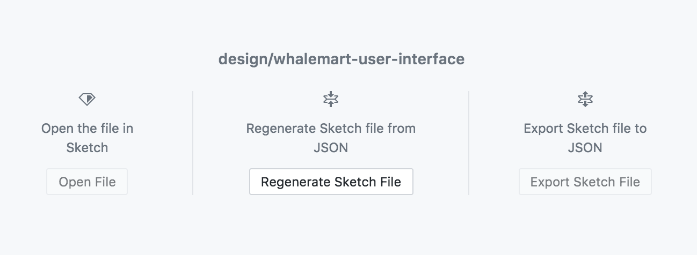

# Snow White and the Seven Pandas

> A team project&#39;s repository as part of 2110423 Software Engineering course 1/2017

_Whalemart_ is a market space matching platform which allows flea market vendor and flea market lessor to make an agreement on each booth area easily.

## Table of Contents

- [Documents](#documents)
- [Developing](#developing)
- [Contributing Design](#contributing-design)
- [Contributors](#contributors)
- [License](#license)

## Documents

- [Problem Statement](./doc/problem-statement/problem-statement.md)
- [Requirements Specification](./doc/requirements-specification/requirements-specification.md)
- [Design Document](./doc/design-document/design-document.md)

## Developing

### Prerequisites

#### General

- [Docker Community Edition](https://www.docker.com/community-edition) `17.09.0-ce` or higher
- [Docker Compose](https://docs.docker.com/compose/install) `1.17.0` or higher

#### Frontend-webapp

This is used for developing in a `frontend-webapp`.

- [Node.js](https://nodejs.org/) `8.9.1` or higher
- [Yarn](https://yarnpkg.com/en/docs/install) `1.3.2` or higher (as a `npm` replacement)
- [Angular CLI](https://github.com/angular/angular-cli#prerequisites) `1.5.0` or higher (can be installed using Yarn by using command `yarn global add @angular/cli`)

> Note: [nvm](https://github.com/creationix/nvm#installation) is recommended.

### Quickstart

Run `docker-compose up --build` within project folder. The development environment will be spinned up.

You can then access the followings:

- Webapp (build using [Angular](angular.io)) via [localhost:4200](http://localhost:4200)
- API Server (built using [Django REST framework](http://www.django-rest-framework.org/)) via [localhost:8000](http://localhost:8000)
- [pgAdmin](https://www.pgadmin.org/) via [localhost:5050](http://localhost:5050) for Postgres database GUI access
  - Username: `pgadmin4@pgadmin.org`
  - Password: `admin`
  - Database username: `postgres`
  - Database password: `postgres`

### Git Convention

#### Branching

1. **Consider** branch out feature branch from `master` branch for easier management.
2. **Do** use kebab casing for branch name, and **consider** prefix branch name with _backend_ or _frontend_. For example, `backend/facebook-login-api` and `frontend/market-page`.
8. **Consider** making a [PR](https://help.github.com/articles/about-pull-requests/) and having someone review your code instead of merging directly to a `master` branch.

#### Commits

1. **Consider** having each commit representing only _single_ logical change.
2. **Do** having the first line of the commit message be a summary of the commit.
3. **Do** capitalize the first line of the commit message, and **don't** end the first line with a period, e.g. `Add Facebook login API` (without trailing period).
5. **Do** use [imperative mood](https://chris.beams.io/posts/git-commit/#imperative) for the first line of th commit message.

## Contributing Design

Our design team uses [Sketch](https://www.sketchapp.com/) as a design tool for prototyping high-fidelity user interface. However, due to the limitation of versioning sketch's binary files on Git, we decided to use Kactus, the design version control, as a complement to facilitate design workflow. For further information on Kactus, please visit https://kactus.io/help/how-to/.

In order to collaborate, first, you have to clone this repository and access all available design work products inside the [`design`](./design) directory.

After installing Kactus, you can regenerate a sketch file from JSON by directly clicking the `Regenerate Sketch File` button inside the Kactus app.

 
<i>Figure 1: Regenerating sketch file in Kactus
</i>

When you make some changes to sketch files, Kactus watches those files and re-parses them automatically. Please note that at this step Kactus is required to be opened. This parsed (or exploded) view of your sketch file is what git tracks. So, you can use your preferred Git client to commit your work and push to the remote as usual.

You can also peek and leave comments on the current Whalemart's UI at [https://sketch.cloud/s/ELk4v/ui/](https://sketch.cloud/s/ELk4v/ui/).

## Contributors

<b>Kasidit Iamthong</b> 
Student ID: 5731005321 
GitHub: <a href="https://github.com/futurizing">@futurizing</a>

 

<b>Kawin Liaowongphuthorn</b> 
Student ID: 5731004721 
GitHub: <a href="https://github.com/KawinL">@KawinL</a>

 

<b>Korrawe Karunratanakul</b> 
Student ID: 5731002421 
GitHub: <a href="https://github.com/korrawe">@korrawe</a>

 

<b>Kosate Limpongsa</b> 
Student ID: 5731012721 
GitHub: <a href="https://github.com/neungkl">@neungkl</a>

 

<b>Parinthorn Saithong</b> 
Student ID: 5730329521 
GitHub: <a href="https://github.com/pirsquareff">@pirsquareff</a>

 

<b>Poomarin Phloyaphisut</b> 
Student ID: 5731091221 
GitHub: <a href="https://github.com/PoomarinPh">@PoomarinPh</a>

 

<b>Sirinthra Chantharaj</b> 
Student ID: 5730635521 
GitHub: <a href="https://github.com/sirinthra-cc">@sirinthra-cc</a>

 

<b>Thanat Jatuphattharachat</b> 
Student ID: 5730243121 
GitHub: <a href="https://github.com/JThanat">@JThanat</a>

## License

[MIT](LICENSE) © 2017 Snow White and the Seven Pandas
