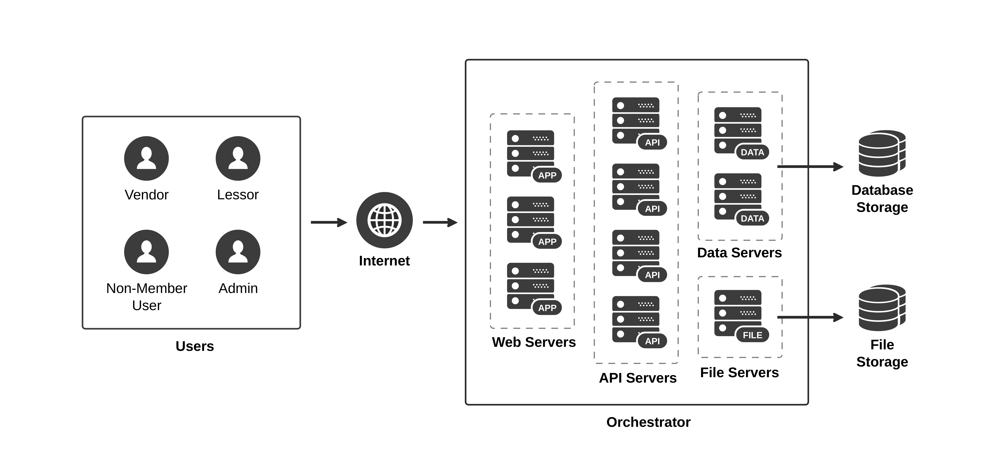

# 1. Introduction

## 1.1.	Objective
The objective of the design document is to further develop the requirement specification document and the analysis document. Most of the document relates with designing and simulating the system. The detail in this document will be used for the future system architecture design, implementation, and testing.

## 1.2.	System Goal and Overview
To solve the flea market reservation and management problems, the development team decided to develop a web-based application which is a platform for matching flea market vendors and available booth area. There are 3 main parts of our system.
First, function for flea market lessors. To be able to curate the booth into a single place, we have to provide the system that allows flea market lessors to add their booth. Each booth should provide enough information for flea market vendors such as booth’s location, provided equipment, rental fee, and so on.
Second, function for flea market vendors. This function allows flea market vendors to view all the available booth area. Flea market vendors can choose the interested booth location to get more information such as rental fee, time slot, and so on. After they decide to rent this booth location, they can reserve it or cancel their reservation any time within the deposit payment period.

 
<i>Figure 1-1: To-be system’s user flow
</i>

The last one is payment system. Flea market vendors can either pay by credit card or bank transfer. After a reservation is confirmed, to complete a transaction, flea market vendors have to deposit 30% of the total rental fee and the remaining within the deposit payment and full payment period, respectively.

## 1.3.	Technical System Overview
When user requests for a web page, the client connects to one of available web servers. A web server might connect to any API servers to authenticate the user. It will then serve the user’s client with the web page. The web page, created on the Angular framework, will fetch the data from an API server via a REST protocol.
An API server is connected to a data server to do CRUD operations on a database. A data server connected to a database storage hosts a database engine and listens for a query from an API server. All servers are connected and managed by an orchestration tool so that the system is responsive to rapid changes. The technical overview of the system can be roughly illustrated in Figure 1 2.

 
<i>Figure 1-2: Technical overview of the to-be system
</i>

