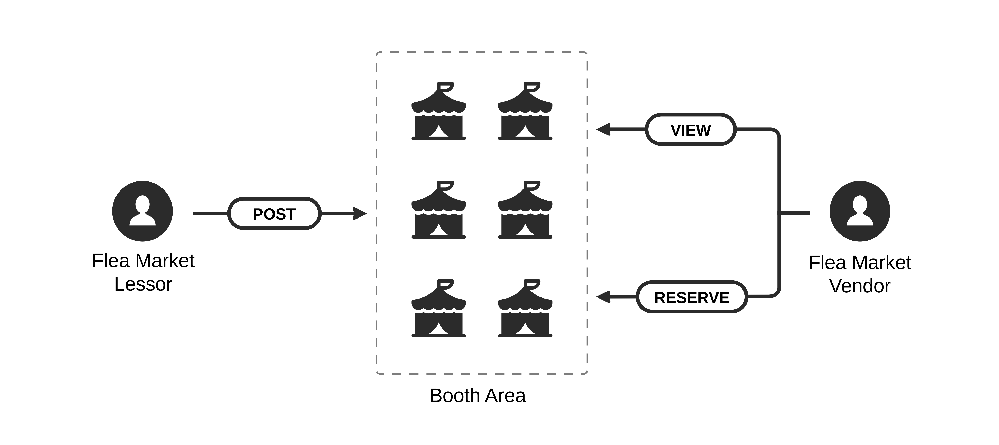

# Problem Statement

### Authors

| Student ID | Name                          | Contribution                                                                     |
|:---------- |:----------------------------- |:-------------------------------------------------------------------------------- |
| 5730329521 | Parinthorn Saithong (Leader)  | Solution, System Overview, System Scope                                          |
| 5730243121 | Thanat Jatuphattharachat      | Background and Significance of the Problem, System Overview, Definition of Terms |
| 5730635521 | Sirinthra Chantharaj          | Solution, Objective, System Overview, System Scope                               |
| 5731002421 | Korrawe Karunratanakul        | Input and Output of the System                                                   |
| 5731004721 | Kawin Liaowongphuthorn        | Input and Output of the System                                                   |
| 5731005321 | Kasidit Iamthong              | Background and Significance of the Problem                                       |
| 5731012721 | Kosate Limpongsa              | Constraints                                                                      |
| 5731091221 | Poomarin Phloyaphisut         | Constraints                                                                      |

### Date
23 August 2017

## Table of Contents

1. [Definition of Terms](#1-definition-of-terms)
1. [Background and Significance of the Problem](#2-background-and-significance-of-the-problem)
1. [Solution](#3-solution)
1. [Objective](#4-objective)
1. [System Overview](#5-system-overview)
1. [Scope of the System](#6-scope-of-the-system)
1. [Input and Output of the System](#7-input-and-output-of-the-system)
1. [Constraints](#8-constraints)

## 1. Definition of Terms

- **Booth**: A small temporary tent or structure at flea market for each vendor to sell and promote their merchandise.
- **Booth Area**: An area for each vendor to set up for selling their merchandise.
- **Booth Layout**: A layout showing the arrangement of the booths in the market area.
- **Booth Number**: A number used to specify the booth and its position.
- **Member ID**: A number used to uniquely specify a vendor after booth reservation and registration.
- **Deposit**: A first installment that vendors pay to lessor to reserve an available booth.
- **Flea Market**: A type of market that rents or provides space to people who want to sell merchandise.
- **Flea Market Lessor**: An owner of flea market who owns the area for rent.
- **Flea Market Vendor**: A person who is interested in selling merchandise in the flea market area.
- **Payment**: An action or process that vendors pay to lessors.
- **Payment Amount**: A sum of money that a vendor should pay to a lessor.
- **Payment Installment**: A sum of money due as one of several payments that vendors need to pay to the lessor.
- **Payment Term**: A term and condition of a payment method.
- **Register**: An action that vendor apply or reserve for a booth.

## 2. Background and Significance of the Problem
Flea market has become a popular attraction in Thailand for both local people and travelers. Flea market has more than 14% market share over all the market in Thailand. This means there are more than 50,000 vendors currently in the market. Therefore, the booth management system is important for managing this amount of vendors.

Online flea market booth rental and reservation system used by lessors to provide available booths for vendors should be simple and effective system. The vendors should be able to know available booth and booth layout in real time and make the reservation of the booth that they need as fast as possible. The system should also help vendors to simplify their reservation, payment and confirmation process. On the other hand, this system should reduce lessors' reservation management process and let the lessors consider vendors profile and arrange the booths easily. In addition, it should support payment verification for lessors in order to confirm renters’ payment.

However, the current flea market booth rental and reservation is done using multiple platforms. This includes chat application such as Line and Messenger, Facebook, Email and bank money transfer service. Firstly, each vendor has to get the booth layout and booth detail from the announcement of each flea market Facebook page, Line official or other official communication channels. After that, each vendor has to fill out the application form and submit the application via the lessor official email and wait for the member ID. When they get the member ID, they will be able to apply for the booth and then wait for the result again. When the reserved booth area is ready, the vendors have to pay for a reservation deposit within the time limit. Therefore, this process consumes lots of time. Furthermore, they will not know other available booths or any up to date booth layout if they want to re-apply for the booth after being rejected. Sometimes, the reservation process is even worse. Each vendor has to reserve the booth with the lessor by chatting only. This is difficult for the vendors to get all the detail and is complicated for lessors to manage and reply all interested vendors.

Nowadays, people are more familiar with online reservation systems such as plane ticket reservation, concert ticket reservation, hotel reservation, and movie ticket reservation. Therefore, online flea market booth rental and reservation system can solve the problems and improve the reservation process for both lessors and vendors as listed in [Table 3-1](#3-solution)

## 3. Solution
| Problem                                                                                                              | Solution                                                                                  | Urgency | Clarity | Precedence |
|:-------------------------------------------------------------------------------------------------------------------- |:----------------------------------------------------------------------------------------- |:------- |:------- |:---------- |
| Flea market vendors have difficulty in finding the place to sell their merchandises                                   | Develop a web-based application that is easily accessible via the Internet                | High    | Medium  | 2          |
| Flea market lessors want to find as much vendors as possible to rent booths in the flea market                       | Develop a system which allows flea market lessors to promote their booth area             | High    | High    | 1          |
| It is a waste of booth area for both lessors and vendors if some vendors do not make a payment after the reservation | Develop a system which provides payment channel and also deposit-refund system            | High    | Medium  | 2          |
| Flea market vendors do not know which booth area are already reserved                                                | Develop a system which updates booth layout with available and reserved flag every minute | Medium  | High    | 1          |
| In some platform(fin-market), flea market vendors have to wait almost 3 days to acquire a user id                   | Develop a system which allows flea market vendors and lessors to register in no time      | High    | High    | 1          |

*Table 3-1: Solution of each problem along with its urgency, clarity, and precedence*

## 4. Objective
The main objective of this system is to provide a market space matching platform which allows flea market vendor and flea market lessor to make an agreement on each booth area easily. 

## 5. System Overview
To solve these problems, we decided to develop a web-based application which is a platform for matching flea market vendors and available booth area. There are three main parts of the system.

First, function for flea market lessors. To be able to curate the booth into a single place, we have to provide the system that allows flea market lessors to add their booth. Each booth should provide enough information for flea market vendors such as booth’s location, provided equipment, price, and so on.

Second, function for flea market vendors. This function allows flea market vendors to view all the available booth area. Flea market vendors can choose the interested booth location to get more information such as price, time slot, and so on. After they decide to rent this booth location, they can reserve it or cancel their reservation any time within the deposit payment period. 

 
<i>Figure 5-1: To be system's user flow</i>

The last one is payment system. Flea market vendors are able to either pay by credit card or bank transfer. After a reservation is confirmed, to complete a transaction, flea market vendors have to deposit 30% of the total price and the remaining within the deposit payment and full payment period, respectively.

## 6. Scope of the System
The whole system consists of 4 smaller parts as follow:

1. Registration
    * Flea market lessors and vendors can register to the system
    * Flea market lessors and vendors can log in to the system
    * Flea market lessors and vendors can log out off the system
    * Flea market lessors and vendors can edit their account
    * Flea market lessors and vendors can delete their account
2. Function for flea market lessors
    * Flea market lessors can create booth area
    * Flea market lessors can add booths’ information including:
      * Price for each booth
      * Time slot
      * Provided equipment
      * Agreement for using booth area
    * Flea market lessors can edit booths’ information
    * Flea market lessors can delete booths from the system
    * Flea market lessors can view their booths’ status
3. Function for flea market vendors
    * Flea market vendors can view all booth area
    * Flea market vendors can confirm their reservation
    * Flea market vendors can cancel their reservation
4. Payment
    * Flea market lessors can set due date of deposit payment and full payment
    * Flea market vendors have to deposit 30% of the price within deposit payment period after confirming a reservation 
    * Flea market vendors can pay the remaining 70% of price before the full payment due date
    * Flea market vendors can either pay by credit card or bank transfer

## 7. Input and Output of the System
Our users are divided into two groups including flea market lessors who provide free booth area and flea market vendors who want to find the available booth area. The available actions for each type of user are explained below.

1. Flea market lessors
    * Can create or cancel booth reservation
    * Can add or edit booth area information
    * Can add or edit booth layout of their booths
    * Can set or edit the price, time frame, provided equipment, and restriction for each booth area
    * Can view the current availability of each booth area
    * Can set due date of deposit payment and full payment of each booth reservation
2. Flea market vendors
    * Can view each booth area information and booth layout
    * Can make a reservation on an available booth area
    * Can cancel their reservation before the time limit set by the lessors
    * Can select the payment method
    * Can view their reservation status

| User type          | Objective                                     | Input                                                                                                 | Output/Result                                                         |
|:------------------ |:--------------------------------------------- |:----------------------------------------------------------------------------------------------------- |:--------------------------------------------------------------------- |
| Flea market lessor | Register as a new lessor in the system          | Name - Last name  Address  Phone number  E-mail  Payment gateway  Username  Password                   | User ID                                                               |
|                    | Login to the system                           | Username Password                                                                                     | Lessor can access the service that system provide                    |
|                    | Provide booth area in flea maket for rent | Booth Layout Booth detail such as price, equipment and merchandise detail   Address of flea market Detail of flea market | Flea market vendors can find markets and their available booth area in the system                 |
| Flea market vendor | Register as new vendor in the system          | Name - Last name Address Phone number E-mail Username Password                                         | Member ID                                                       |
|                   | Login to the system                           | Username Password                                                                                     | Vendor can access the service that system provide.                   |
|                   | Search for flea market                        | Date Address Price range Merchandise details                                                         | Flea markets and booth layouts that match vendor’s input.       |
|                   | Reserve a booth                               | Accepted price Merchandise details                                                                    | Lessor can view the property of vendors and decide to accept or reject. |

*Table 7-1: Input and output of the system*

## 8. Constraints
1. Time limitations 
    This project will be planned and developed in 3 months (by the end of November).
2. Budget limitations 
    Since this system is developed from the ground up, new hardware needs to be purchased to support the developing process and to operate the system. The estimation of the expense is shown below.
    * MacBook Air 13” 2015 (x4) 300,000 Baht
    * Cloud server (CPU x8 cores 3.30 GHz and Memory 64 GB) 125,000 Baht
    * Project development (Cost per person x 8) 360,000 Baht
    Total cost in development (estimate fully-development in 4 months) 785,000 Baht
3. Hardware
    * The server must provide support all the time
    * The application must be available with higher than 99.9% available rate
    * The average latency response time must be lower than 250ms
    * The server must be capable of scaling during peak time
4. Software
    * The minimum version of browser that application is fully support is Internet Explorer 9 or above and all modern browsers
    * The application is support with both mobile platform and screen platform
    * The application must be capable of rearranging the designed elements to fit in any screens
5. Personnel 
    Our team consists of 8 people. Most of our team members have experience in developing and deploying web applications. So, planning and developing this project would be done with very few issues.
