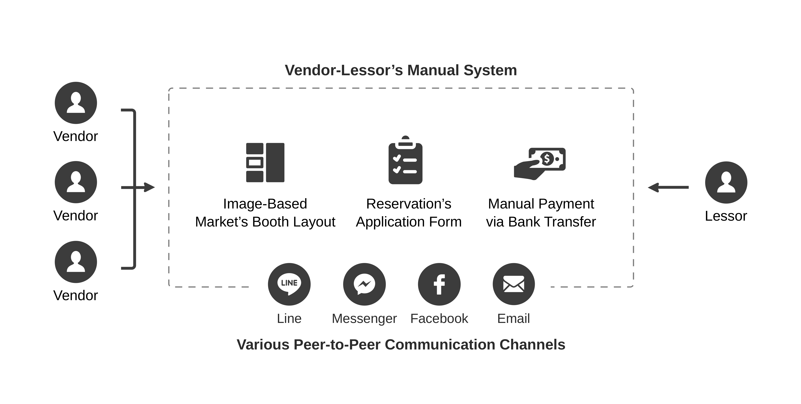
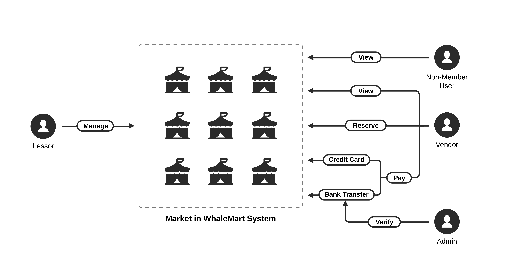

# 1. Problem Statement
**1.1. Background and Significance of the Problem**

Flea market has become a popular attraction in Thailand for both local people and travelers. Flea market has more than 14% market share over all the market in Thailand. This means there are more than 50,000 vendors currently in the market. Therefore, the booth management system is important for managing this number of vendors.
Online flea market booth rental and reservation system, used by lessors to provide available booths for vendors, should be simple and effective system. The vendors should be able to know available booth and booth layout in real-time and make the reservation of the booth that they need as fast as possible. The system should also help vendors to simplify their reservation, payment, and confirmation process. On the other hand, this system should reduce lessors' reservation management process and let the lessors consider vendors profile and arrange the booths easily. In addition, it should support payment verification for lessors to confirm renters’ payment. 

 
<i>Figure 1‑1: As-is system of the current flea market booth rental and reservation</i>

However, the current flea market booth rental and reservation is done using multiple platforms as shown in Figure 1‑1. This includes chat applications such as Line and Messenger, Facebook, Email, and bank money transfer service. Firstly, each vendor has to get the booth layout and booth detail from the announcement of each flea market Facebook page, Line official, or other official communication channels. After that, each vendor has to fill out the application form and submit the application via the lessor official email and wait for the member ID. When they get the member ID, they will be able to apply for the booth and then wait for the result again. When the reserved booth area is ready, the vendors have to pay for a reservation deposit within the time limit. Therefore, this process consumes lots of time. Furthermore, they will not know other available booths or any up to date booth layout if they want to re-apply for the booth after being rejected.
The reservation process can be worse; each vendor has to reserve the booth with the lessor by chatting only. This is difficult for the vendors to get all the detail and is complicated for lessors to manage and reply all interested vendors. At the same time, a lessor also has to select the vendors according to their reservation and their products. The vendors may choose up to ten booths. Thus, the lessor may have to manually select the booth that is related to the reservation and has to move the vendors name to other booth number reservation list if the lessor does not choose those vendors on their first choice.
Nowadays, people are more familiar with online reservation systems such as plane ticket reservation, concert ticket reservation, hotel reservation, and movie ticket reservation. Therefore, online flea market booth rental and reservation system can solve the problems and improve the reservation process for both lessors and vendors as listed in Table 1-1.

<i>Table 1‑1: Solution of each problem along with its urgency, clarity, and precedence
</i>

| Problem                                                                                                              | Solution                                                                                  | Urgency | Clarity | Precedence |
| -------------------------------------------------------------------------------------------------------------------- | ----------------------------------------------------------------------------------------- | ------- | ------- | ---------- |
| Flea market vendors have difficulty in finding the place to sell their merchandises                                  | Develop a web-based application that is easily accessible via the Internet                | High    | Medium  | 2          |
| Flea market lessors want to find as much vendors as possible to rent booths in the flea market                       | Develop a system which allows flea market lessors to promote their booth area             | High    | High    | 1          |
| It is a waste of booth area for both lessors and vendors if some vendors do not make a payment after the reservation | Develop a system which provides payment channel and deposit-refund system                 | High    | Medium  | 2          |
| Flea market vendors do not know which booth area are already reserved                                                | Develop a system which updates booth layout with available and reserved flag every minute | Medium  | High    | 1          |
| In some platform(fin-market), flea market vendors have to wait almost 3 days to acquire user id                      | Develop a system which allows flea market vendors and lessors to register in no time      | High    | High    | 1          |

**1.2. System Overview**

To solve these problems, we decided to develop a web-based application which is a platform for matching flea market vendors and available booth area. There are 3 main parts of our system.
First, function for flea market lessors. To be able to curate the booth into a single place, we have to provide the system that allows flea market lessors to add their booth. Each booth should provide enough information for flea market vendors such as booth’s location, provided equipment, rental fee, and so on.
Second, function for flea market vendors. This function allows flea market vendors to view all the available booth area. Flea market vendors can choose the interested booth location to get more information such as rental fee, time slot, and so on. After they decide to rent this booth location, they can reserve it or cancel their reservation any time within the deposit payment period. 

 
<i>Figure 1‑2: To-be system’s user flow
</i>

The last one is payment system. Flea market vendors can either pay by credit card or bank transfer. After a reservation is confirmed, to complete a transaction, flea market vendors have to deposit 30% of the total rental fee and the remaining within the deposit payment and full payment period, respectively.

**1.3. 1.1.	Technical System Overview**

When user requests for a web page, the client connects to one of available web servers. A web server might connect to any API servers to authenticate the user. It will then serve the user’s client with the web page. The web page, created on the Angular framework, will fetch the data from an API server via a REST protocol.
An API server is connected to a data server to do CRUD operations on a database. A data server connected to a database storage hosts a database engine and listens for a query from an API server. 
All servers are connected and managed by an orchestration tool so that the system is responsive to rapid changes. The technical overview of the system can be roughly illustrated in Figure 1‑3.

 
<i>Figure 1‑3: Technical overview of the to-be system
</i>

